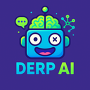

# Fullstack JavaScript Monorepo Derp AI (NestJS, Vite, React Native)

[](./services/web/public/png/derp_ai_icon_128x128.png)
[](https://opensource.org/licenses/MIT)

## Overview

**Derp AI** is an intelligent, interactive web-based chat application designed to provide synthesized answers by leveraging multiple AI models (including Google Gemini and Hugging Face). Built on a modern full-stack TypeScript monorepo architecture (NestJS, React/Vite), Derp AI delivers real-time responses via WebSockets and offers robust user authentication through various OAuth2 providers.

This platform provides a secure, scalable, and feature-rich foundation for AI-driven chat services, suitable for business integration and diverse applications.

**Check out the live demo:** [https://derp.ai.petarzarkov.com/](https://derp.ai.petarzarkov.com/)

## Key Features

- **Intelligent Chat:** AI-powered backend synthesizes answers by querying multiple large language models (e.g., Google Gemini, Hugging Face).
- **Real-time Communication:** Seamless user experience powered by WebSockets ([Socket.io](https://socket.io/)).
- **Modern Frontend:** Fast, responsive web interface built with [Vite](https://vitejs.dev/), [React](https://react.dev/), and the [Chakra UI](https://chakra-ui.com/) component library.
- **Robust Backend:** Scalable API built with [NestJS](https://nestjs.com/) (TypeScript).
- **Secure Authentication:** Multiple OAuth2 login integrations (e.g., Google, LinkedIn - _adjust as applicable_) managed by Passport.js, using secure cookies/sessions.
- **Database Integration:** PostgreSQL persistence layer managed with [TypeORM](https://typeorm.io/).
- **Security Focused:** Includes essential security middleware like Helmet and CORS configuration.
- **Observability:** Structured logging using Pino Logger with context tracking.
- **API Documentation:** Integrated Swagger UI for clear API documentation and testing.
- **Performance & Reliability:** Implements caching, rate limiting (throttling), and domain name setup best practices.
- **Development Experience:** Efficient monorepo managed with `pnpm` workspaces, Docker support, and configurations for unit/integration testing.
- **Integrations:** Includes Slack integration capabilities (_mention specifics if possible_).
- **(Planned) Mobile Support:** Includes a placeholder for future React Native mobile application development.

## Core Components

This monorepo includes the following primary services:

1.  **Web Application (`services/web`)**

    - **Framework:** [Vite](https://vitejs.dev/)
    - **UI Library:** [React](https://react.dev/) with [Chakra UI](https://chakra-ui.com/)
    - **Purpose:** User-facing web interface for interacting with the Derp AI service.

2.  **Backend Server (`services/server`)**

    - **Framework:** [NestJS](https://nestjs.com/) (TypeScript)
    - **Database:** [PostgreSQL](https://www.postgresql.org/) via [TypeORM](https://typeorm.io/)
    - **Real-time:** [Socket.io](https://socket.io/) for WebSocket communication.
    - **AI:** Integrates with external AI APIs (Gemini, Hugging Face, etc.).
    - **Features:** Handles API requests, business logic, data persistence, authentication, WebSocket events, and AI orchestration.
    - **Testing:** Includes Unit & Integration test setup.

3.  **Mobile Application (`services/mobile`)**
    - **Status:** **Not Implemented Yet**
    - **Intended Framework:** [React Native](https://reactnative.dev/)
    - **Purpose:** Placeholder for future native mobile clients.

## Monorepo Management

This repository uses **`pnpm` workspaces** for managing multiple packages within a single repository. Benefits include:

- **Single Source of Truth:** All code resides in one place.
- **Simplified Dependencies:** Efficient handling of shared and service-specific dependencies.
- **Code Sharing:** Potential to easily create shared libraries (`packages/`).
- **Consistent Tooling:** Streamlined commands, linting, and formatting across the project.

## Getting Started

### Prerequisites

Ensure you have the following installed. The specified versions are recommended based on project testing:

- **Node.js:** `>= 22.14.0` (`node -v`)
- **pnpm:** `>= 10.6.2` (`pnpm -v`, install via `npm install -g pnpm@10.6.2`)
- **PostgreSQL:** `>= 17` (Or use the provided Docker setup)
- **Docker:** Latest stable version
- **Docker Compose:** `>= 2.31.0` (Usually included with Docker Desktop)
- **Git:** `>= 2.34.1` (`git --version`)

### Installation

1.  **Clone the repository:**

    ```bash
    git clone [https://github.com/petarzarkov/derp.ai](https://github.com/petarzarkov/derp.ai) derpai
    cd derpai
    ```

2.  **Install dependencies:** (This installs for all services)

    ```bash
    pnpm install
    ```

3.  **Set up Environment Variables:**
    - A default `.env` file is provided with base values.
    - Copy or rename `.env.example` to `.env` if necessary and customize variables (like database credentials and API keys) as needed. Key variables include:
      - `DB_HOST`, `DB_PORT`, `DB_USER`, `DB_PASS`, `DB_NAME`
      - `JWT_SECRET`
      - `GOOGLE_GEMINI_API_KEY`
      - _(Add other relevant AI keys or service URLs here)_

## Development

### Running the Database

1.  Ensure Docker and Docker Compose are running.
2.  Start the development database container (and any other services defined in `docker-compose.yml`):
    ```bash
    # Uses configuration from .env and docker-compose.yml
    # Runs containers in the background
    docker-compose up -d
    ```

### Running Services

You can run services individually or all at once:

- **Run all services concurrently (Web & Server) in watch mode:**

  ```bash
  pnpm dev
  ```

  _(Useful for quick checks, but output can be interleaved. Running separately is often clearer.)_

- **Run only the Backend Server (watch mode):**

  ```bash
  pnpm --filter server dev
  # Or navigate to services/server and run: pnpm run dev
  ```

  - See the [Server README](./services/server/README.md) for more details (migrations, seeding, etc.).

- **Run only the Web Application (watch mode):**
  ```bash
  pnpm --filter web dev
  # Or navigate to services/web and run: pnpm run dev
  ```

### Other Common Commands

- **Build all services:**
  ```bash
  pnpm build
  ```
- **Run tests for all services:**
  ```bash
  pnpm test
  ```

## Running the Backend with Docker

This section focuses on building and running the **backend server** as a Docker container.

1.  **Build the Docker image for the server:**

    ```bash
    # Ensure you are in the root directory
    # You can override the default port (3000) during build if needed
    docker build --build-arg SERVICE_PORT=3033 -t derpai-server .
    ```

2.  **Run the container:**

    - Ensure a PostgreSQL database is accessible to the container (e.g., running via `docker-compose up -d` on the same Docker network, or an external DB).
    - Provide necessary environment variables.

    ```bash
    docker run --rm -it --name derpai-server \
      -p 3033:3033 \
      --network your_docker_network \ # e.g., the network created by docker-compose
      -e SERVICE_PORT=3033 \
      -e APP_ENV=production \
      -e DB_HOST=your_db_host_accessible_from_docker \ # e.g., pgdb-derpai if using default docker-compose
      -e DB_PORT=6570 \
      -e DB_USER=postgres \
      -e DB_PASS=postgres \
      -e DB_NAME=postgres \
      -e JWT_SECRET=your_production_secret \
      -e GOOGLE_GEMINI_API_KEY=<your_api_key> \
      # Add other required environment variables
      derpai-server
    ```

## License

This project is licensed under the MIT License - see the [LICENSE](LICENSE) file for details.
